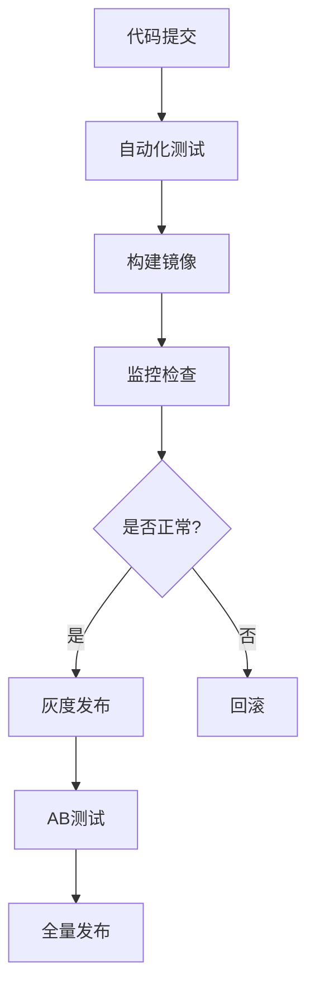
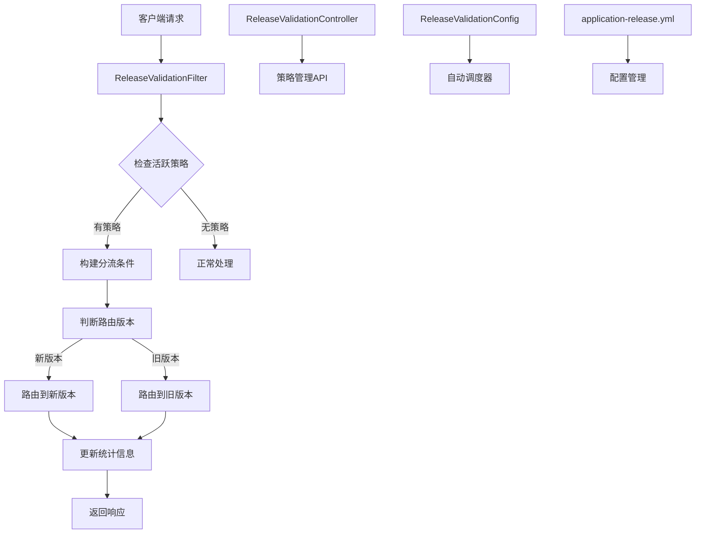

# 网关系统中ReleaseValidationService集成方案

## 1. AB发布（A/B Testing）

定义： 将用户流量按比例分配到两个或多个不同版本的应用，通过对比用户行为数据来评估新版本的效果

特点：

- 同时运行多个版本

- 基于用户行为数据进行决策

- 通常用于功能验证和用户体验优化

- 可以快速回滚

应用场景：

- 新功能验证

- UI/UX 优化测试

- 算法效果对比

- 营销策略测试

## 2. 金丝雀发布（Canary Release）

定义： 先向一小部分用户（通常是内部用户或特定用户群体）发布新版本，观察系统稳定性和用户反馈，确认无问题后再逐步扩大发布范围。

特点：

- 渐进式发布

- 风险可控

- 快速发现问题

- 支持快速回滚

发布流程：

1. 发布到 1-5% 的用户

1. 监控系统指标和用户反馈

1. 确认稳定后逐步扩大范围（10% → 30% → 50% → 100%）

1. 如有问题立即回滚

## 3. 灰度发布（Gray Release）

定义： 在保证系统整体稳定的前提下，按照一定策略逐步将用户流量从旧版本切换到新版本的过程。

特点：

- 平滑过渡

- 风险分散

- 支持多维度灰度策略

- 可随时回滚

灰度策略：

- 按用户比例： 10% → 30% → 50% → 100%

- 按用户群体： 内部用户 → VIP用户 → 普通用户

- 按地域： 单机房 → 多机房 → 全地域

- 按时间： 低峰期 → 高峰期

  

## 渐进式发布策略

采用渐进式的发布流程：

阶段1：灰度发布

阶段2：AB测试




## 1. 集成架构概述

`ReleaseValidationService`通过以下组件集成到API网关系统中：



## 2. 核心组件集成

### 2.1 发布验证过滤器 (ReleaseValidationFilter)

**功能特性：**
- 自动检测活跃的发布策略
- 构建分流条件（用户ID、IP、设备信息等）
- 根据策略类型进行智能分流
- 实时统计和监控
- 响应头注入版本信息

**集成位置：**
```java
@Override
public int getOrder() {
    return Ordered.HIGHEST_PRECEDENCE + 200; // 在版本管理之后，限流之前，在认证之后
}
```

**处理流程：**
1. **策略检测**：从请求路径提取服务名称，查找活跃策略
2. **条件构建**：提取用户ID、IP地址、设备信息等分流条件
3. **版本判断**：根据策略类型（A/B测试、灰度发布、金丝雀发布）判断路由版本
4. **统计更新**：记录请求成功/失败、响应时间等统计信息
5. **响应注入**：在响应头中添加版本标识信息

### 2.2 发布验证控制器 (ReleaseValidationController)

**API接口：**

| 接口类型 | 路径 | 功能描述 |
|---------|------|----------|
| POST | `/api/gateway/release/strategies/ab-test` | 创建A/B测试策略 |
| POST | `/api/gateway/release/strategies/gray-release` | 创建灰度发布策略 |
| POST | `/api/gateway/release/strategies/canary-release` | 创建金丝雀发布策略 |
| POST | `/api/gateway/release/strategies/{id}/start` | 启动发布策略 |
| POST | `/api/gateway/release/strategies/{id}/pause` | 暂停发布策略 |
| POST | `/api/gateway/release/strategies/{id}/complete` | 完成发布策略 |
| POST | `/api/gateway/release/strategies/{id}/rollback` | 回滚发布策略 |
| GET | `/api/gateway/release/strategies` | 获取所有策略 |
| GET | `/api/gateway/release/strategies/{id}` | 获取单个策略 |
| DELETE | `/api/gateway/release/strategies/{id}` | 删除策略 |
| GET | `/api/gateway/release/stats/{id}` | 获取策略统计 |
| GET | `/api/gateway/release/stats` | 获取所有统计 |
| POST | `/api/gateway/release/auto-step` | 手动执行自动步进 |
| GET | `/api/gateway/release/version` | 获取发布版本号 |

### 2.3 发布验证配置 (ReleaseValidationConfig)

**调度器配置：**

| 调度器 | 执行频率 | 功能描述 |
|--------|----------|----------|
| autoStepTrafficScheduler | 5分钟 | 自动步进流量（灰度发布） |
| releaseStrategyHealthCheck | 10分钟 | 发布策略健康检查 |
| cleanupCompletedStrategies | 1小时 | 清理已完成策略 |

**健康检查逻辑：**
- 错误率监控：超过10%警告，超过20%考虑自动回滚
- 响应时间监控：超过5秒警告
- 自动回滚机制：可配置的自动回滚阈值

## 3. 配置管理

### 3.1 应用配置 (application-release.yml)

**核心配置项：**
```yaml
release-validation:
  enabled: true
  
  auto-step:
    enabled: true
    interval-seconds: 300
    step-percent: 10
    max-steps: 10
  
  health-check:
    enabled: true
    interval-seconds: 600
    error-rate-threshold: 0.1
    response-time-threshold: 5000
    auto-rollback-threshold: 0.2
  
  strategy:
    ab-test:
      default-duration: 3600
      success-criteria: "errorRate < 0.05 && avgResponseTime < 2000"
    
    gray-release:
      default-step-percent: 10
      default-step-interval: 300
      success-criteria: "errorRate < 0.02 && avgResponseTime < 1500"
    
    canary-release:
      default-duration: 7200
      success-criteria: "errorRate < 0.01 && avgResponseTime < 1000"
```

### 3.2 路由配置

**默认过滤器配置：**
```yaml
spring:
  cloud:
    gateway:
      default-filters:
        - ReleaseValidationFilter
```

**管理API路由：**
```yaml
routes:
  - id: release-validation-api
    uri: http://localhost:8080
    predicates:
      - Path=/api/gateway/release/**
    filters:
      - StripPrefix=0
      - name: ReleaseValidationFilter
        args:
          enabled: true
```

## 4. 使用示例

### 4.1 创建A/B测试策略

```bash
curl -X POST "http://localhost:8080/api/gateway/release/strategies/ab-test" \
  -H "Content-Type: application/x-www-form-urlencoded" \
  -d "serviceName=user-service" \
  -d "baseRouteId=user-service-v1" \
  -d "newRouteId=user-service-v2" \
  -d "trafficPercent=50"
```

**响应示例：**
```json
{
  "success": true,
  "strategy": {
    "id": "ab-test-user-service-1640995200000",
    "name": "A/B测试-user-service",
    "type": "A_B_TEST",
    "status": "PENDING",
    "currentTrafficPercent": 0,
    "targetTrafficPercent": 50
  },
  "message": "A/B test strategy created successfully"
}
```

### 4.2 启动发布策略

```bash
curl -X POST "http://localhost:8080/api/gateway/release/strategies/ab-test-user-service-1640995200000/start"
```

### 4.3 查看发布统计

```bash
curl "http://localhost:8080/api/gateway/release/stats/ab-test-user-service-1640995200000"
```

**响应示例：**
```json
{
  "success": true,
  "stats": {
    "strategyId": "ab-test-user-service-1640995200000",
    "totalRequests": 1000,
    "newVersionRequests": 500,
    "oldVersionRequests": 500,
    "newVersionSuccess": 485,
    "oldVersionSuccess": 490,
    "newVersionErrors": 15,
    "oldVersionErrors": 10,
    "newVersionErrorRate": 0.03,
    "oldVersionErrorRate": 0.02,
    "newVersionAvgResponseTime": 1200,
    "oldVersionAvgResponseTime": 1100
  }
}
```

## 5. 监控和告警

### 5.1 监控指标

**核心指标：**
- `total_requests`：总请求数
- `new_version_requests`：新版本请求数
- `old_version_requests`：旧版本请求数
- `new_version_error_rate`：新版本错误率
- `old_version_error_rate`：旧版本错误率
- `new_version_avg_response_time`：新版本平均响应时间
- `old_version_avg_response_time`：旧版本平均响应时间

### 5.2 告警规则

**错误率告警：**
- 警告：新版本错误率 > 10%
- 严重：新版本错误率 > 20%（触发自动回滚）

**响应时间告警：**
- 警告：新版本平均响应时间 > 5秒

**流量告警：**
- 警告：新版本请求数异常波动

### 5.3 健康检查

**自动健康检查：**
- 每10分钟检查一次所有运行中的策略
- 检查错误率、响应时间等关键指标
- 支持自动回滚机制

## 6. 最佳实践

### 6.1 策略创建

**A/B测试策略：**
- 建议流量比例：10%-50%
- 测试时长：1-24小时
- 成功标准：错误率 < 5%，响应时间 < 2秒

**灰度发布策略：**
- 初始流量：5%-10%
- 步进间隔：5-15分钟
- 步进比例：5%-20%
- 成功标准：错误率 < 2%，响应时间 < 1.5秒

**金丝雀发布策略：**
- 目标用户：内部测试用户、VIP用户
- 测试时长：2-8小时
- 成功标准：错误率 < 1%，响应时间 < 1秒

### 6.2 监控建议

**实时监控：**
- 设置错误率告警阈值
- 监控响应时间变化
- 关注流量分布情况

**定期检查：**
- 每日检查策略运行状态
- 每周分析发布效果
- 每月优化策略配置

### 6.3 回滚策略

**自动回滚：**
- 错误率超过20%自动回滚
- 响应时间超过10秒自动回滚
- 连续失败次数超过阈值自动回滚

**手动回滚：**
- 通过API接口手动回滚
- 支持部分回滚和完全回滚
- 保留回滚历史记录

## 7. 故障处理

### 7.1 常见问题

**策略不生效：**
- 检查策略状态是否为RUNNING
- 确认服务名称匹配
- 验证路由ID是否正确

**分流不均匀：**
- 检查分流算法配置
- 确认用户ID/IP提取逻辑
- 验证哈希算法实现

**统计不准确：**
- 检查统计更新逻辑
- 确认请求路径匹配
- 验证时间戳处理

### 7.2 故障恢复

**服务重启：**
- 策略配置会丢失（内存存储）
- 建议实现持久化存储
- 支持配置热加载

**网络异常：**
- 自动降级到旧版本
- 记录异常统计信息
- 支持手动干预

## 8. 总结

### 8.1 集成优势

- **无缝集成**：通过过滤器机制无缝集成到网关请求处理流程
- **灵活配置**：支持多种发布策略和配置参数
- **实时监控**：提供完整的监控和统计功能
- **自动管理**：支持自动步进、健康检查、告警等功能
- **易于使用**：提供完整的REST API接口

### 8.2 应用场景

- **新功能发布**：通过灰度发布逐步推广新功能
- **性能对比**：通过A/B测试对比新旧版本性能
- **风险控制**：通过金丝雀发布控制发布风险
- **快速回滚**：支持快速回滚到稳定版本

### 8.3 技术栈

- **Spring Cloud Gateway**：网关框架
- **Project Reactor**：响应式编程
- **Spring Boot Actuator**：监控端点
- **Spring Scheduling**：定时任务
- **ConcurrentHashMap**：并发缓存 