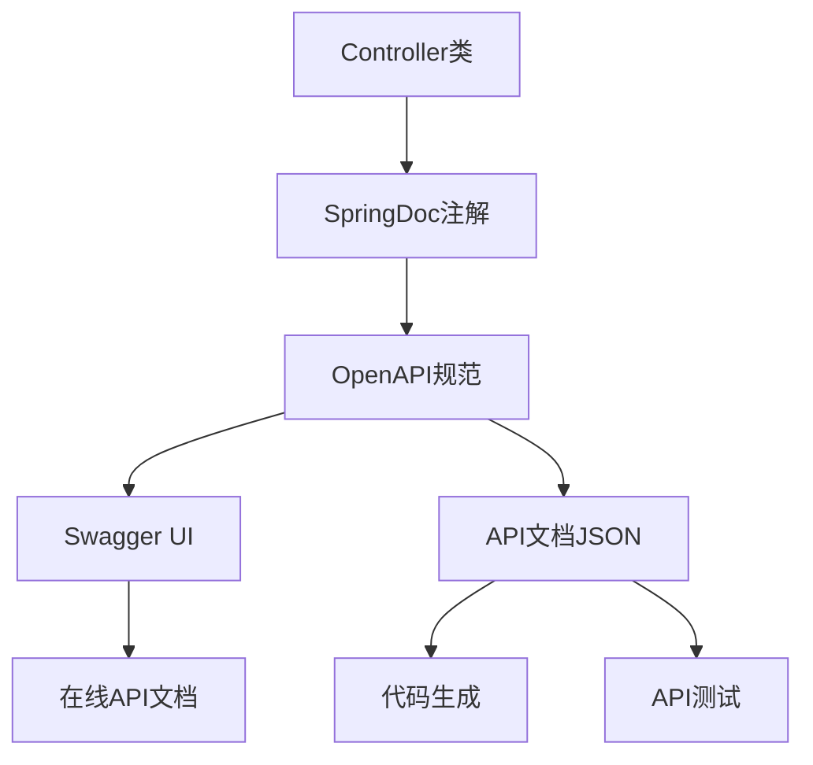

# 网关系统中的API文档和Swagger管理

## 1. API文档架构概述

网关系统采用**OpenAPI 3.0规范**，基于SpringDoc实现API文档的自动生成和管理：



### 1.1 技术栈
- **SpringDoc OpenAPI**：API文档生成框架
- **OpenAPI 3.0**：API规范标准
- **Swagger UI**：API文档可视化界面
- **Spring Boot Actuator**：API管理端点

## 2. 核心配置

### 2.1 Swagger配置 (SwaggerConfig)

**配置内容：**
```java
@Configuration
public class SwaggerConfig {
    @Bean
    public OpenAPI customOpenAPI() {
        return new OpenAPI()
                .info(new Info()
                        .title("API Gateway")
                        .description("大型网关系统API文档")
                        .version("1.0.0")
                        .contact(new Contact()
                                .name("Gateway Team")
                                .email("gateway@citi.com")
                                .url("https://github.com/citi/gateway"))
                        .license(new License()
                                .name("Apache 2.0")
                                .url("https://www.apache.org/licenses/LICENSE-2.0")))
                .servers(List.of(
                        new Server().url("http://localhost:8080").description("开发环境"),
                        new Server().url("https://gateway-dev.citi.com").description("测试环境"),
                        new Server().url("https://gateway.citi.com").description("生产环境")
                ));
    }
}
```

**配置特性：**
- **多环境支持**：开发、测试、生产环境配置
- **联系信息**：团队联系方式和项目地址
- **许可证信息**：Apache 2.0开源许可证
- **版本管理**：API版本控制

### 2.2 SpringDoc配置

**application.yml配置：**
```yaml
# SpringDoc OpenAPI配置
springdoc:
  api-docs:
    path: /api-docs
  swagger-ui:
    path: /swagger-ui.html
    enabled: true
  default-produces-media-type: application/json
  default-consumes-media-type: application/json
```

**配置说明：**
- **api-docs.path**：OpenAPI JSON文档路径
- **swagger-ui.path**：Swagger UI界面路径
- **swagger-ui.enabled**：是否启用Swagger UI
- **default-produces-media-type**：默认响应媒体类型
- **default-consumes-media-type**：默认请求媒体类型

## 3. 依赖管理

### 3.1 Maven/Gradle依赖

**SpringDoc依赖：**
```gradle
// API Documentation
implementation 'org.springdoc:springdoc-openapi-starter-webflux-ui:2.3.0'
```

**依赖说明：**
- **springdoc-openapi-starter-webflux-ui**：WebFlux环境下的OpenAPI支持
- **版本2.3.0**：与Spring Boot 3.5.3兼容
- **WebFlux支持**：响应式编程环境支持

## 4. API文档访问

### 4.1 文档访问地址

| 环境 | Swagger UI地址 | OpenAPI JSON地址 |
|------|---------------|------------------|
| 开发环境 | http://localhost:8080/swagger-ui.html | http://localhost:8080/api-docs |
| 测试环境 | https://gateway-dev.citi.com/swagger-ui.html | https://gateway-dev.citi.com/api-docs |
| 生产环境 | https://gateway.citi.com/swagger-ui.html | https://gateway.citi.com/api-docs |

### 4.2 文档功能特性

**Swagger UI功能：**
- **API浏览**：按控制器分组浏览API
- **在线测试**：直接在界面上测试API
- **参数验证**：自动参数格式验证
- **响应示例**：显示响应数据示例
- **认证支持**：支持JWT等认证方式

**OpenAPI JSON功能：**
- **代码生成**：支持多种语言的客户端代码生成
- **API测试**：支持Postman等工具导入
- **文档导出**：支持PDF、HTML等格式导出

## 5. API分组管理

### 5.1 控制器分组

**主要API分组：**

| 分组名称 | 控制器 | 功能描述 |
|---------|--------|----------|
| 动态路由管理 | DynamicRouteController | 路由的增删改查、批量操作 |
| 服务降级管理 | ServiceDegradationController | 服务降级策略配置 |
| 限流测试 | RateLimitTestController | 限流功能测试 |
| QPS监控 | QPSMonitorController | QPS统计和监控 |
| 负载均衡 | LoadBalancerController | 负载均衡策略管理 |
| 服务发现 | ServiceDiscoveryController | 服务注册发现管理 |
| 链路追踪 | TraceController | 链路追踪管理 |
| 审计日志 | AuditController | 审计日志管理 |
| 监控管理 | MonitorController | 系统监控管理 |
| 支付服务 | PaymentController | 支付相关API |
| 降级处理 | FallbackController | 服务降级处理 |
| WebClient测试 | WebClientTestController | WebClient功能测试 |

### 5.2 API版本管理

**版本支持：**
- **v1**：基础版本，核心功能
- **v2**：增强版本，新增功能（默认版本）
- **v3**：最新版本，实验性功能

**版本兼容性：**
```yaml
api-version:
  compatibility:
    v1: v1
    v2: v1,v2
    v3: v2,v3
```

## 6. API文档规范

### 6.1 注解使用规范

**控制器级别注解：**
```java
@RestController
@RequestMapping("/api/gateway/routes")
@Tag(name = "动态路由管理", description = "提供路由的动态管理功能")
public class DynamicRouteController {
    // 控制器实现
}
```

**方法级别注解：**
```java
@Operation(summary = "获取所有路由", description = "返回系统中所有配置的路由信息")
@ApiResponses(value = {
    @ApiResponse(responseCode = "200", description = "成功获取路由列表"),
    @ApiResponse(responseCode = "500", description = "服务器内部错误")
})
@GetMapping
public Mono<ResponseEntity<List<DynamicRouteDefinition>>> getAllRoutes() {
    // 方法实现
}
```

**参数注解：**
```java
@Parameter(description = "路由ID", required = true, example = "user-service-route")
@PathVariable String routeId
```

### 6.2 响应模型定义

**响应模型示例：**
```java
@Schema(description = "动态路由定义")
public static class DynamicRouteDefinition {
    @Schema(description = "路由ID", example = "user-service-route")
    private String id;
    
    @Schema(description = "路由名称", example = "用户服务路由")
    private String name;
    
    @Schema(description = "目标URI", example = "http://user-service:8080")
    private String uri;
    
    @Schema(description = "是否启用", example = "true")
    private boolean enabled;
}
```

## 7. API文档管理

### 7.1 文档更新机制

**自动更新：**
- 代码变更时自动更新文档
- 注解变更时实时反映
- 版本发布时同步更新

**手动更新：**
- 通过管理接口刷新文档
- 支持文档版本控制
- 支持文档回滚

### 7.2 文档质量控制

**质量检查：**
- API覆盖率检查
- 参数完整性验证
- 响应示例完整性
- 文档一致性检查

**最佳实践：**
- 及时更新API文档
- 提供完整的参数说明
- 包含错误响应示例
- 保持文档与代码同步

## 8. API测试支持

### 8.1 Swagger UI测试

**测试功能：**
- 在线API测试
- 参数自动验证
- 响应数据展示
- 错误信息显示

**测试流程：**
1. 选择API接口
2. 填写请求参数
3. 点击执行按钮
4. 查看响应结果

### 8.2 外部工具集成

**Postman集成：**
- 支持OpenAPI JSON导入
- 自动生成测试集合
- 环境变量配置
- 批量测试支持

**其他工具：**
- Insomnia
- ApiPost
- 自定义测试工具

## 9. 安全配置

### 9.1 文档访问控制

**生产环境配置：**
```yaml
# 生产环境禁用Swagger UI
springdoc:
  swagger-ui:
    enabled: false
  api-docs:
    enabled: false
```

**开发环境配置：**
```yaml
# 开发环境启用Swagger UI
springdoc:
  swagger-ui:
    enabled: true
  api-docs:
    enabled: true
```

### 9.2 认证集成

**JWT认证支持：**
```java
@SecurityScheme(
    name = "bearerAuth",
    type = SecuritySchemeType.HTTP,
    bearerFormat = "JWT",
    scheme = "bearer"
)
```

**OAuth2认证支持：**
```java
@SecurityScheme(
    name = "oauth2",
    type = SecuritySchemeType.OAUTH2,
    flows = @OAuthFlows(
        authorizationCode = @OAuthFlow(
            authorizationUrl = "https://auth.citi.com/oauth/authorize",
            tokenUrl = "https://auth.citi.com/oauth/token"
        )
    )
)
```

## 10. 监控和统计

### 10.1 文档访问统计

**统计指标：**
- 文档访问次数
- API测试次数
- 热门API排行
- 错误率统计

**监控接口：**
```java
@GetMapping("/api-docs/stats")
public ResponseEntity<Map<String, Object>> getApiDocsStats() {
    // 返回文档访问统计信息
}
```

### 10.2 性能监控

**性能指标：**
- 文档生成时间
- 页面加载时间
- API响应时间
- 缓存命中率

## 11. 最佳实践

### 11.1 文档编写规范

**命名规范：**
- 使用清晰的中文描述
- 保持命名一致性
- 遵循RESTful规范

**内容规范：**
- 提供完整的参数说明
- 包含请求和响应示例
- 说明错误码和错误信息
- 标注API的版本信息

### 11.2 版本管理规范

**版本命名：**
- 使用语义化版本号
- 主版本号：不兼容的API修改
- 次版本号：向下兼容的功能性新增
- 修订号：向下兼容的问题修正

**兼容性管理：**
- 保持向后兼容
- 提供迁移指南
- 设置合理的废弃期

## 12. 总结

### 12.1 系统优势

- **自动生成**：基于注解自动生成API文档
- **多环境支持**：开发、测试、生产环境配置
- **在线测试**：支持直接在界面上测试API
- **版本管理**：完善的API版本控制机制
- **安全控制**：生产环境可禁用文档访问

### 12.2 应用场景

- **API开发**：开发人员快速了解API接口
- **API测试**：测试人员在线测试API功能
- **API集成**：第三方开发者集成API服务
- **API文档**：提供完整的API使用文档

### 12.3 技术栈

- **SpringDoc OpenAPI**：API文档生成框架
- **OpenAPI 3.0**：API规范标准
- **Swagger UI**：API文档可视化界面
- **Spring Boot**：基础框架支持 