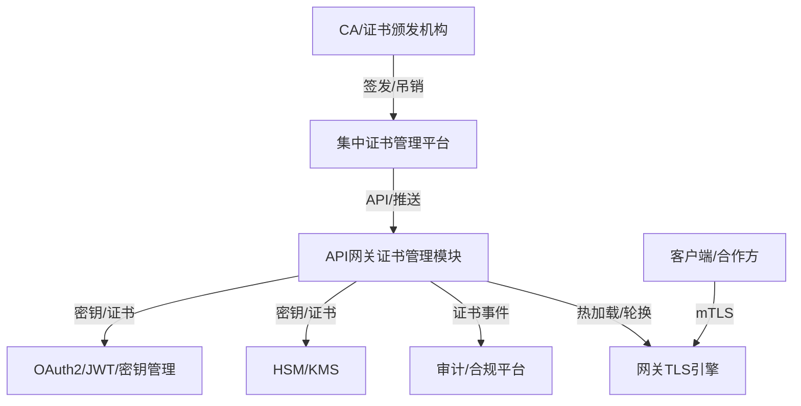

### 1. 证书与密钥远程加载、缓存、热加载

* cert/RemoteCertificateLoader.java、cert/HttpCertificateLoader.java：定义并实现HTTP拉取证书，自动解析为X509Certificate，支持本地缓存与热加载。
* crypto/RemoteKeyLoader.java、crypto/HttpKeyLoader.java：定义并实现HTTP拉取密钥（以RSA公钥为例），支持本地缓存与热加载。
* cert/CertificateManagerImpl.java、crypto/KeyManagerImpl.java：集成远程加载、缓存、定时热加载、审计。

### 2. JWT/OAuth2高性能认证

* crypto/JwtKeyProvider.java：JWT密钥提供者接口，支持多租户多kid。
* oauth/OAuth2PublicKeySyncService.java：JWKs自动同步与本地缓存，定时拉取远程JWKs endpoint，O(1)查找。
* filter/JwtAuthenticationFilter.java：Spring WebFlux风格JWT认证过滤器，集成密钥服务，支持多租户多kid，性能优先。

### 3. 依赖说明

* 证书/密钥解析用到com.fasterxml.jackson.databind、org.apache.commons.codec.binary.Base64、java.security等。
* JWKs同步用到com.nimbusds:nimbus-jose-jwt。
* JWT解析用到io.jsonwebtoken:jjwt-api等。
* Spring定时任务用到@Scheduled，需在主类加@EnableScheduling。

### 4. 性能与安全

* 所有证书/密钥/JWKs均本地缓存，查找O(1)。
* 远程加载/同步异步进行，主流程不阻塞。
* 支持多线程并发安全（ConcurrentHashMap）。
* 支持多租户、密钥轮换、热加载。

# 架构设计

# . 关键能力与实现思路

## 2.1 集中证书管理平台

* 证书申请、签发、续期、吊销、分发、审计全生命周期管理
* 支持API推送/拉取证书、CRL、OCSP信息
* 支持与HSM/KMS集成，密钥不落盘

## 2.2 网关证书管理模块

* 本地缓存所有活跃证书/密钥，支持SNI多证书
* 定时/事件驱动从平台拉取/接收证书、吊销、CRL/OCSP信息
* 证书热加载，无需重启
* mTLS支持，可动态信任不同CA
* 证书吊销，支持CRL/OCSP
* 证书操作审计，所有变更有日志

## 2.3 HSM/KMS集成

* 私钥/密钥存储在HSM/KMS，签名操作在硬件中完成
* 证书管理平台与HSM/KMS对接，网关只拿到公钥/证书

## 2.4 OAuth2/JWT/密钥协同

* JWT签名密钥与证书管理平台统一管理
* 支持多kid，密钥轮换平滑
* 证书吊销/密钥失效自动同步到JWT校验

---

# 3. 详细代码实现（Spring Cloud Gateway/Netty为例）

## 3.1 证书管理服务（本地缓存+平台同步）

java

Apply to CertificateM...

**flowchart **TD

**    **CA**[**CA/证书颁发机构**]** -->|签发/吊销| **CertPlatform**[**集中证书管理平台**]

**    CertPlatform -->|API/推送| **Gateway**[**API网关证书管理模块**]**

**    Gateway -->|热加载/轮换| **Netty**[**网关TLS引擎**]**

**    **Client**[**客户端/合作方**]** -->|mTLS| **Netty**

**    Gateway -->|证书事件| **Audit**[**审计/合规平台**]**

**    Gateway -->|密钥/证书| **HSMKMS**[**HSM/KMS**]**

**    Gateway -->|密钥/证书| **OAuth2**[**OAuth2/JWT/密钥管理**]**

---

## 3.2 动态TLS/SNI多证书支持

## 3.3 mTLS客户端证书认证

* 配置clientAuth: REQUIRE
* 动态TrustManager校验客户端证书
* 可结合租户/合作方白名单

---

## 3.4 证书轮换与热加载

* 证书管理平台推送/网关定时拉取新证书
* 新旧证书/kid并存，平滑切换
* 证书/密钥变更时，动态刷新Netty SslContext

---

## 3.5 证书吊销（CRL/OCSP）

* 定时同步CRL/OCSP信息到本地
* 动态TrustManager校验证书是否吊销

---

## 3.6 HSM/KMS集成

* 私钥不落盘，签名操作通过HSM/KMS API完成
* 证书管理平台与HSM/KMS对接，网关只拿到公钥/证书

---

## 3.7 审计与自动化

* 所有证书操作（申请、续期、吊销、加载、轮换）写入审计日志
* 可推送到SIEM/合规平台
* 支持API/控制台自助管理证书

---

## 3.8 与OAuth2/JWT/密钥管理协同

* JWT签名密钥与证书管理平台统一管理
* 支持多kid，密钥轮换平滑
* 证书吊销/密钥失效自动同步到JWT校验
* OAuth2授权服务器与网关共用密钥/证书管理体系

---

# 4. 性能优化建议

* 本地缓存所有活跃证书/密钥，减少IO/网络开销
* 异步/事件驱动同步证书/吊销信息，避免阻塞
* 多线程/无锁结构，保证高并发下的证书查找和校验性能
* HSM/KMS硬件加速签名，避免私钥泄漏
* 证书热加载，无感知切换，避免重启

---

# 5. 典型证书管理平台选型

* 开源：HashiCorp Vault、cert-manager（K8s）、Smallstep CA
* 商用：CFCA、Entrust、DigiCert、阿里云KMS/证书服务、AWS ACM
* 自研：结合银行合规和流程自研证书管理平台

---

# 6. 总结

* 银行API网关证书管理需全生命周期、自动化、集中化、合规化
* 推荐引入集中证书管理平台，与HSM/KMS集成
* 网关需支持动态证书加载、SNI多证书、mTLS、CRL/OCSP、审计、自动化等能力
* 证书/密钥管理与OAuth2/JWT/密钥体系协同，统一安全体系
* 所有操作需有审计日志，满足合规要求
